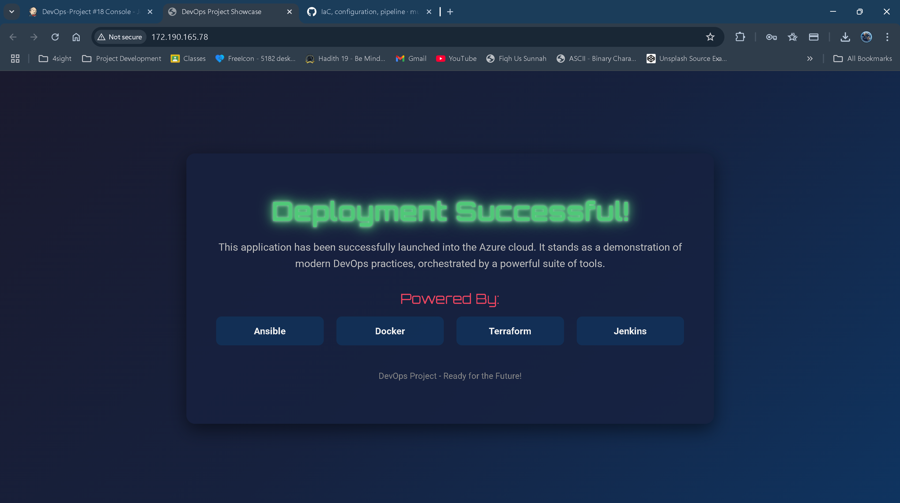
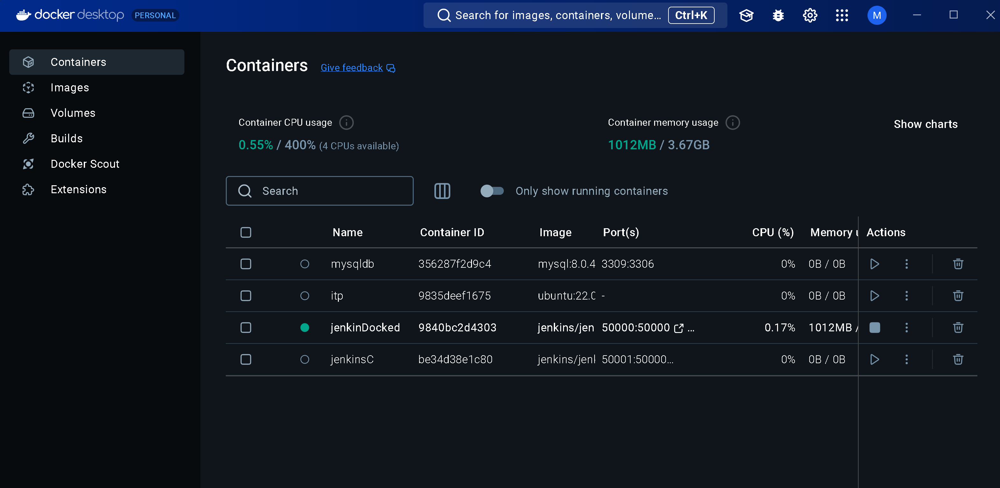
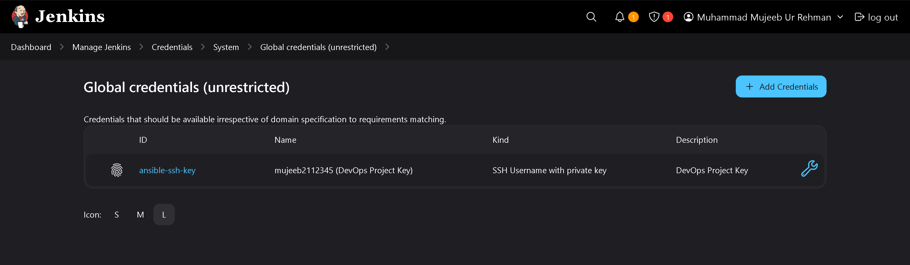
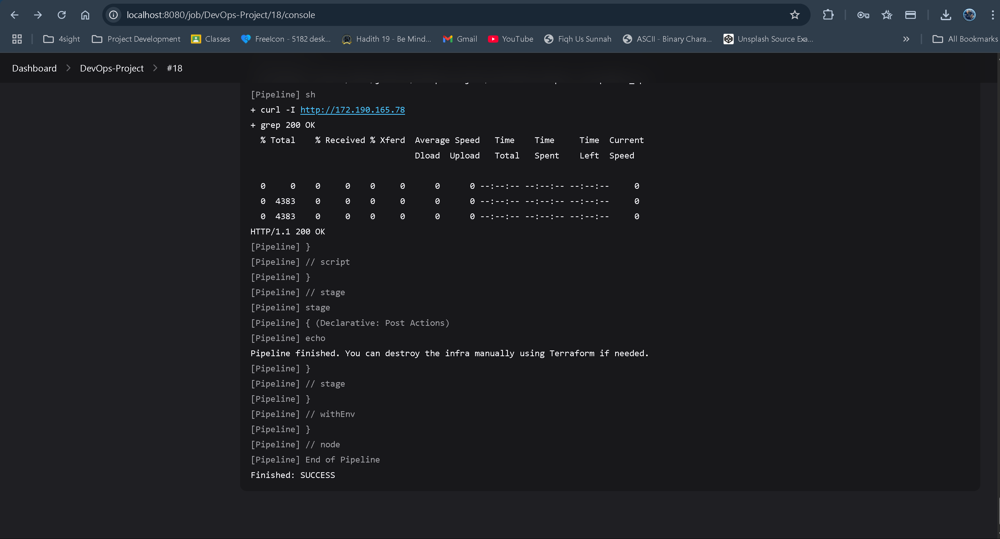

# 🔧 DevOps Automation Project: Provisioning and Configuration with Terraform, Ansible, and Jenkins

This project automates the provisioning of a virtual machine on Azure using **Terraform**, configures it using **Ansible**, and orchestrates the entire pipeline using **Jenkins** running in a Docker container.



---

## 📁 Project Structure

```
DevOps-Project/
│
├── terraform/           # Contains all Terraform IaC files
├── ansible/             # Contains Ansible playbook and inventory
├── app/index.html       # Custom HTML page deployed to VM
├── Jenkinsfile          # Declarative pipeline script
└── README.md            # You're here
```

---

## 🔧 Environment Setup

### Tools Required

-   **Terraform** (installed manually in Jenkins container)
-   **Ansible** (also installed manually inside Jenkins container)
-   **Jenkins** (run inside Docker container)
-   **Docker** (for Jenkins host)
-   **Azure** (VM deployment target)

### Jenkins Container Setup and Tool Installation

For this project, I chose to install tools manually within the standard `jenkins/jenkins:lts` Docker container after it was started. This approach contrasts with building a custom Docker image where tools are pre-installed. Here’s a look at why manual installation was suitable for my development phase, and the general benefits of custom Docker images:

**Why Manual Installation (suited for this project's development & learning phase):**

-   **Rapid Iteration & Flexibility:** When experimenting with tool versions or adding new utilities, direct installation in a running container is faster than rebuilding a Docker image. This accelerates the development feedback loop.
-   **Direct Learning Experience:** Manually setting up tools provides a clearer understanding of their dependencies and installation processes.
-   **Utilizing Official Jenkins Base:** I start with the well-maintained official `jenkins/jenkins:lts` image, ensuring a stable Jenkins environment, and then add tools as needed.

**Benefits of Custom Docker Images (generally for stable/production environments):**

While I used manual installation here, custom Docker images are often preferred, especially for team collaboration and production pipelines, because they offer:

-   **Reproducibility & Consistency:** Guarantees that all environments (developer machines, CI agents, production) use the exact same tool versions, as they are baked into the image.
-   **Faster Agent/Slave Startup:** Jenkins agents or slaves using such an image can start more quickly because tools are pre-installed, not downloaded or configured at runtime.
-   **Version Control of Environment:** The Dockerfile defining the image is version-controlled, providing an auditable history of the environment's configuration.
-   **Simplified Agent Configuration in Jenkins:** Jenkins can be configured to pull a specific image tag, simplifying agent setup.

**1. Start the Jenkins Container (if not already running):**

This command starts the Jenkins LTS container, mapping necessary ports and volumes.

```bash
docker run -d -p 8080:8080 -p 50000:50000 \
  -v jenkins_home:/var/jenkins_home \
  -v /var/run/docker.sock:/var/run/docker.sock \
  --name jenkins jenkins/jenkins:lts
```




**2. Access the Container Shell:**

To install the tools, you need to get a shell inside the running Jenkins container. I used the `root` user for package installation privileges, as the default `jenkins` user does not have them.

```bash
docker exec -it -u root jenkins bin/bash
```

**3. Install Required Tools:**

Once inside the container's shell, execute the following commands:

**a. Update Package Lists:**
It's good practice to update the package lists before installing new software.

```bash
apt-get update
```

**b. Install Ansible:**
Ansible is installed using pip, Python's package installer.

```bash
apt-get install -y python3-pip
pip3 install ansible --break-system-packages
ansible --version
```

**c. Install Terraform (version 1.11.3):**
Terraform is installed by downloading the binary from HashiCorp.

```bash
apt-get install -y curl unzip
TERRAFORM_VERSION="1.11.3"
curl -O "https://releases.hashicorp.com/terraform/${TERRAFORM_VERSION}/terraform_${TERRAFORM_VERSION}_linux_amd64.zip"
unzip "terraform_${TERRAFORM_VERSION}_linux_amd64.zip"
mv terraform /usr/local/bin/
rm "terraform_${TERRAFORM_VERSION}_linux_amd64.zip"
terraform --version
```

**d. Install Azure CLI:**
The Azure CLI is used to interact with your Azure subscription.

```bash
apt-get install -y azure-cli
az --version
```

**4. Authenticate with Azure:**

After installing the Azure CLI, I logged in to my Azure account. This authentication allows Terraform (when configured to use Azure CLI authentication) and other scripts to manage resources in our Azure subscription.

```bash
az login
```

---

## 🌍 Infrastructure Provisioning with Terraform

Terraform scripts are inside the `terraform/` directory. The key actions are:

-   Define the Azure provider
-   Create a Resource Group, VNet, NSG and Public IP
-   Deploy a Linux Virtual Machine
-   Inject the SSH public key into the VM

**Important**: I copied my SSH public key (`id_rsa.pub`) to `/home/jenkins/.ssh/` and referenced it in the Terraform script like so:

```hcl
variable "mujeeb-pub-key" {
  default = file("/home/jenkins/.ssh/id_rsa.pub")
}
```

The `output` block for public IP:

```hcl
output "public_ip" {
  value = azurerm_public_ip.vm_ip.ip_address
}
```

---

## ⚙️ Configuration Management with Ansible

Ansible playbook is located at `ansible/deploy-project.yml`. The tasks include:

1. Update apt cache
2. Install Apache
3. Start and enable Apache
4. Create a directory `/home/mujeeb2112345/ansible_lab`
5. Copy a custom `index.html` from `ansible/app/index.html` to `/var/www/html/`

```yaml
- name: Deploy custom index.html
  copy:
      src: app/index.html
      dest: /var/www/html/index.html
      owner: www-data
      group: www-data
      mode: "0644"
```

I disabled SSH host fingerprint confirmation during automation:

```bash
ANSIBLE_HOST_KEY_CHECKING=False
```

---

## 📜 Jenkins Pipeline (Jenkinsfile)

My pipeline consists of multiple stages and is defined in the root `Jenkinsfile`.

### Key Environment Variables

```groovy
environment {
  TF_DIR = "/home/jenkins/DevOps-Project/terraform"
  ANSIBLE_DIR = "/home/jenkins/DevOps-Project/ansible"
  INVENTORY_FILE = "${ANSIBLE_DIR}/inventory.ini"
  SSH_CREDENTIALS_ID = "ansible-ssh-key"
}
```

### Stage Breakdown

#### 1. Terraform Init & Apply

```groovy
sh 'terraform init'
sh 'terraform apply -auto-approve'
```

#### 2. Extract Public IP and Generate Inventory

Terraform output is extracted:

```groovy
def publicIp = sh(script: "terraform -chdir=${env.TF_DIR} output -raw public_ip", returnStdout: true).trim()
```

Then, an inventory is created:

```ini
[azure_vm]
${publicIp} ansible_user=mujeeb2112345 ansible_ssh_private_key_file=/home/jenkins/.ssh/ansible_key.pem
```

#### 3. Inject SSH Key

SSH private key is pulled from Jenkins credentials and copied:



```groovy
withCredentials([sshUserPrivateKey(credentialsId: "${env.SSH_CREDENTIALS_ID}", keyFileVariable: 'SSH_KEY')]) {
  sh 'cp $SSH_KEY /home/jenkins/.ssh/ansible_key.pem && chmod 600 /home/jenkins/.ssh/ansible_key.pem'
}
```

#### 4. Run Ansible Playbook

```bash
ANSIBLE_HOST_KEY_CHECKING=False ansible-playbook -i inventory.ini deploy-project.yml
```

#### 5. Verify Apache

```bash
curl -I http://${publicIp} | grep '200 OK'
```



---

## 🐞 Troubleshooting & Fixes

| Problem                            | Resolution                                                     |
| ---------------------------------- | -------------------------------------------------------------- |
| `public_ip` empty from Terraform   | Added output block and ensured resource is tied to a public IP |
| Ansible stuck on Gathering Facts   | Disabled host key checking and verified IP                     |
| `copy, src` conflict               | Fixed YAML formatting in playbook                              |
| Jenkins couldn't connect to GitHub | DNS issue fixed inside container                               |
| SSH permission denied              | Used `chmod 600` and correct Jenkins credential injection      |

---

## 📌 Learnings

-   SSH automation needs explicit key permission handling
-   Host key checking must be disabled or fingerprints must be pre-accepted
-   Using Jenkins credentials securely injects sensitive data like private keys
-   Manual installation inside Jenkins container avoids Docker image build overhead during dev

---

## 🏁 Final Thoughts

This project ties together core DevOps skills:

-   IaC with Terraform
-   Configuration with Ansible
-   CI/CD with Jenkins

It reflects a production-like approach with secure key management, dynamic inventory, and well-separated concerns.

---


> Built by Mujeeb Rehman – BSCS DevOps Lab Project 2025
